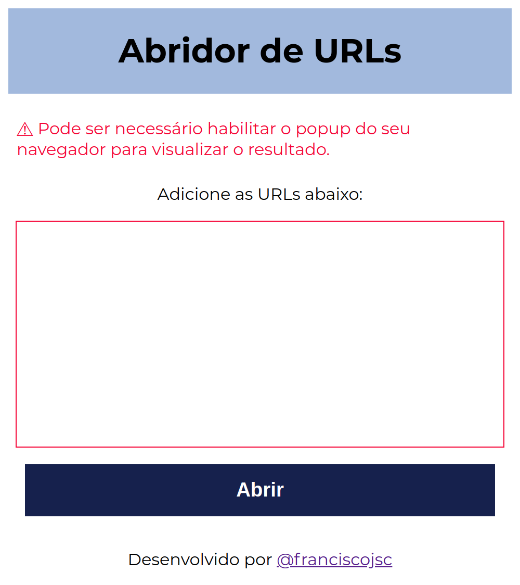
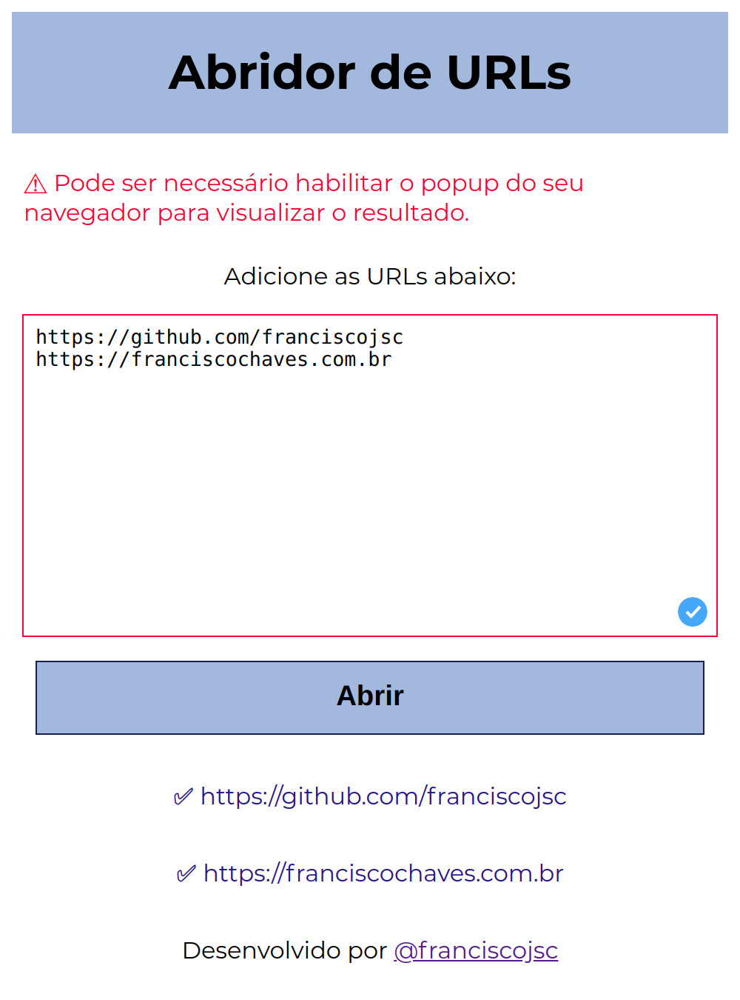

# :globe_with_meridians: Abridor de URLs :globe_with_meridians:

O **abridor de URLs** é simples e fácil, ideal para abrir vários links de forma simultânea.

## :camera: Screenshots

### Página inicial

### Página inicial após abrir URLs

